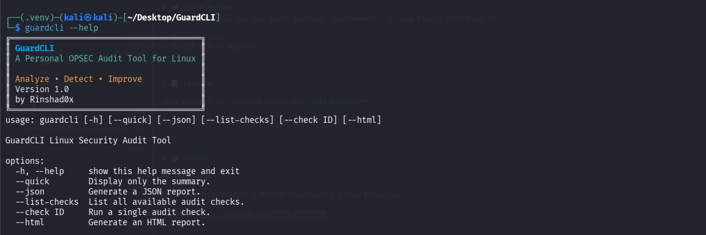
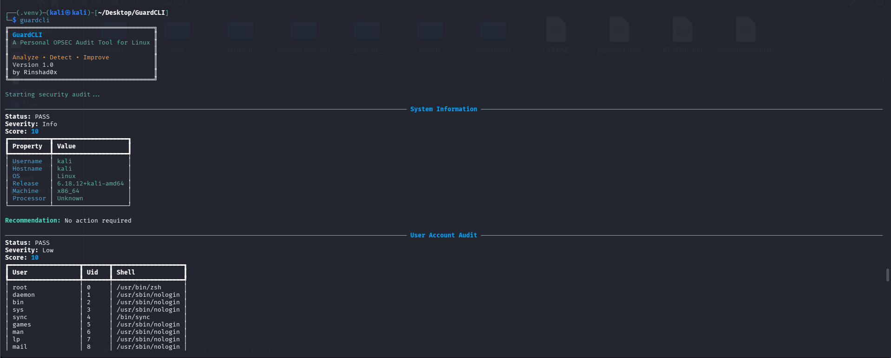
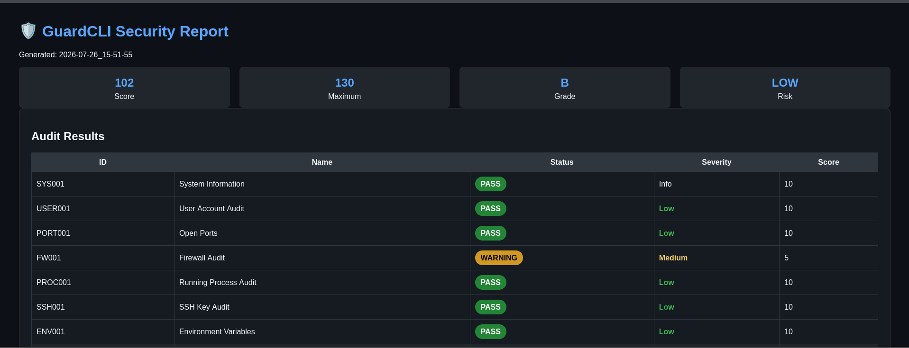

# 🛡️ GuardCLI

<p align="center">
  <strong>A Personal OPSEC Audit Tool for Linux</strong>
</p>

<p align="center">
Analyze • Detect • Improve
</p>

<p align="center">


</p>

---

## 📖 Overview

GuardCLI is a modular Linux security auditing tool written in Python that helps users identify common security weaknesses and misconfigurations on Linux systems.

The project was designed as a lightweight OPSEC (Operational Security) auditing utility that performs multiple security checks and presents the results in a clean terminal interface along with optional HTML and JSON reports.

Whether you're learning Linux security, performing personal system audits, or practicing cybersecurity concepts, GuardCLI provides an easy way to analyze your system.

---

## ✨ Features

- 🛡️ Modular security audit engine
- 📊 Security score calculation
- 🚨 Risk level assessment
- 📄 HTML report generation
- 📁 JSON report generation
- 🎨 Rich terminal interface
- ⚡ Lightweight and fast
- 🔍 Run individual audit modules
- 📦 Installable CLI application (`guardcli`)

---

# 🔍 Audit Modules

| ID | Module |
|----|------------------------------|
| SYS001 | System Information |
| USR001 | User Account Audit |
| PORT001 | Open Ports Audit |
| FW001 | Firewall Audit |
| PROC001 | Running Process Audit |
| SSH001 | SSH Key Audit |
| SSHD001 | SSH Configuration Audit |
| ENV001 | Environment Variables Audit |
| PERM001 | File Permission Audit |
| HIST001 | Shell History Audit |
| SUID001 | SUID Binary Audit |
| CRON001 | Cron Job Audit |
| WW001 | World Writable File Audit |

---

# 📷 Screenshots

## 📷 Help Menu

<p align="center">
    
</p>

## Terminal Output

<p align="center">
    
</p>


---

## HTML Report

<p align="center">
    
</p>


---

# 🚀 Installation

Clone the repository

```bash
git clone https://github.com/Rinshad0x/guardcli.git
```

Move into the project directory

```bash
cd guardcli
```

Create a virtual environment

```bash
python3 -m venv .venv
```

Activate the environment

```bash
source .venv/bin/activate
```

Install GuardCLI

```bash
pip install -e .
```

---

# 💻 Usage

Run a complete audit

```bash
guardcli
```

Run a specific audit

```bash
guardcli --check SSHD001
```

Generate a JSON report

```bash
guardcli --json
```

Generate an HTML report

```bash
guardcli --html
```

Display only the summary

```bash
guardcli --quick
```

List all available audit modules

```bash
guardcli --list-checks
```

Show help

```bash
guardcli --help
```

---

# 📁 Project Structure

```
GuardCLI
│
├── guardcli/
│   ├── audit.py
│   ├── engine.py
│   ├── registry.py
│   ├── report.py
│   ├── utils.py
│   ├── templates/
│   └── checks/
│
├── assets/
├── docs/
├── screenshots/
├── reports/
├── LICENSE
├── README.md
├── pyproject.toml
└── requirements.txt
```

---

# 📊 Output

GuardCLI provides:

- Terminal summary
- Security score
- Risk level
- Detailed findings
- Recommendations
- HTML report
- JSON report

---

# 🎯 Roadmap

## Version 1.0 ✅

- Modular audit engine
- Rich CLI interface
- HTML reporting
- JSON reporting
- Security scoring
- 13+ audit modules

## Future Versions

- Docker Security Audit
- Password Policy Audit
- Sudo Configuration Audit
- Kernel Hardening Audit
- Package Update Audit
- Plugin Support
- PDF Report Export
- Configuration File Support

---

# ⚠️ Disclaimer

GuardCLI is intended for:

- Defensive Security
- System Auditing
- Cybersecurity Learning
- Personal Linux Security Assessments

Always ensure you have proper authorization before auditing systems that you do not own or manage.

---

# 🤝 Contributing

Contributions are welcome!

If you have ideas for new audit modules, improvements, or bug fixes, feel free to:

- Open an Issue
- Submit a Pull Request

---

# 📄 License

This project is licensed under the **MIT License**.

See the **LICENSE** file for more information.

---

# 👨‍💻 Author

## Rinshad0x

Cybersecurity Researcher | Python Developer | Linux Enthusiast

GitHub: https://github.com/Rinshad0x

---

<p align="center">
Made with ❤️ and Python
</p>